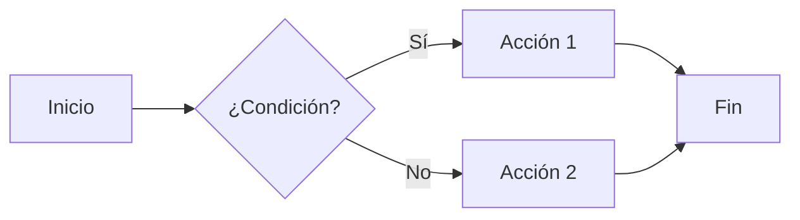
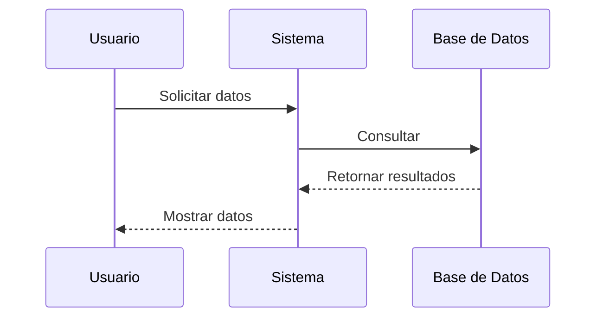

# 📚 Mis Documentaciones

¡Bienvenido a mi repositorio de documentación de proyectos!

Este sitio contiene la documentación de todos mis proyectos organizados por categorías técnicas. Aquí encontrarás guías, ejemplos y referencias de todo lo que he desarrollado.

---

## 🗂️ Categorías de Proyectos

<div class="grid cards" markdown>

-   :fontawesome-brands-python:{ .lg .middle } __Python__

    ---

    Proyectos desarrollados en Python: juegos, scripts, automatizaciones y más.

    [:octicons-arrow-right-24: Ver proyectos Python](python/index.md)

-   :fontawesome-brands-html5:{ .lg .middle } __Implantación de aplicaciones Web__

    ---

    Aplicaciones web, diseño frontend y backend con diferentes tecnologías.

    [:octicons-arrow-right-24: Ver proyectos Web](web/index.md)

-   :fontawesome-solid-database:{ .lg .middle } __Bases de Datos__

    ---

    Proyectos relacionados con bases de datos SQL, MySQL, SQLite y más.

    [:octicons-arrow-right-24: Ver proyectos BD](bases-datos/index.md)

-   :fontawesome-solid-network-wired:{ .lg .middle } __Redes__

    ---

    Configuración de redes, servidores y servicios de red.

    [:octicons-arrow-right-24: Ver proyectos Redes](redes/index.md)

-   :fontawesome-solid-shield-halved:{ .lg .middle } __Seguridad__

    ---

    Proyectos de seguridad informática y alta disponibilidad.

    [:octicons-arrow-right-24: Ver proyectos Seguridad](seguridad/index.md)

-   :fontawesome-solid-file-code:{ .lg .middle } __Plantillas__

    ---

    Plantillas reutilizables para documentar nuevos proyectos.

    [:octicons-arrow-right-24: Ver plantillas](templates/plantilla-proyecto.md)

</div>

---

## 🎯 Objetivo del Sitio

Este sitio me sirve como:

- ✅ **Repositorio centralizado** de toda mi documentación
- ✅ **Referencia rápida** para recordar cómo funcionan mis proyectos
- ✅ **Portfolio** de mi trabajo y aprendizaje
- ✅ **Base de conocimiento** para futuros proyectos

---

## 🚀 Últimas Actualizaciones

!!! tip "Proyecto Destacado"
    **BuscaMinas** - Juego completo en Python con interfaz de consola, sistema de puntuaciones y múltiples niveles de dificultad.
    
    [Ver documentación →](python/buscaminas.md){ .md-button .md-button--primary }

---

## 📖 Cómo Usar Esta Documentación

1. **Navega** por las pestañas superiores para explorar cada categoría
2. **Busca** proyectos específicos usando el buscador (🔍)
3. **Consulta** las plantillas para ver la estructura estándar
4. **Contacta** conmigo a través de mi [perfil de GitHub](https://github.com/pabloceda)

---

!!! question "¿Tienes dudas?"
    Si tienes preguntas sobre algún proyecto o quieres colaborar, no dudes en contactarme.

---

# 🎨 Referencia de Estilos Markdown

Esta sección muestra **todos los estilos y características** disponibles en Material for MkDocs.

---

## 📝 Admonitions (Callouts)

Las admonitions son bloques especiales para destacar información:

!!! note "Nota Importante"
    Esta es una nota informativa con el estilo `note`.

!!! tip "Consejo Útil"
    Este es un consejo con el estilo `tip`. ¡Muy útil para dar recomendaciones!

!!! warning "Advertencia"
    Esto es una advertencia con el estilo `warning`. ⚠️

!!! danger "Peligro"
    Este es un mensaje de peligro con el estilo `danger`. 🚨

!!! success "Éxito"
    Operación completada con éxito. ✅

!!! info "Información"
    Información adicional relevante.

!!! example "Ejemplo"
    ```python
    def ejemplo():
        return "Hola Mundo"
    ```

??? question "Admonition Colapsable"
    Este bloque está colapsado por defecto. ¡Haz click para expandir!
    
    Puedes incluir cualquier contenido aquí:
    
    - Listas
    - Código
    - Tablas

???+ abstract "Abierto por Defecto"
    Este bloque colapsable está **abierto por defecto** gracias al `+`.

---

## 🎨 Formato de Texto

### Estilos Básicos

- **Texto en negrita**
- *Texto en cursiva*
- ***Texto en negrita y cursiva***
- ~~Texto tachado~~
- ==Texto resaltado==
- H~2~O (subíndice)
- 2^10^ (superíndice)

### Listas de Tareas

- [x] Tarea completada
- [x] Otra tarea hecha
- [ ] Tarea pendiente
- [ ] Otra por hacer

---

## 💻 Bloques de Código

### Python con números de línea

```python linenums="1" title="ejemplo.py"
def saludar(nombre):
    """
    Función que saluda a una persona.
    
    Args:
        nombre (str): Nombre de la persona
    """
    print(f"¡Hola, {nombre}!")  # (1)!
    return True

# Llamada a la función
saludar("Pablo")  # (2)!
```

1.  Imprime el saludo en consola
2.  Llamamos a la función con el nombre "Pablo"

### JavaScript

```javascript title="app.js"
const calcular = (a, b) => {
    return a + b;
};

console.log(calcular(5, 3)); // Resultado: 8
```

### SQL

```sql title="consulta.sql"
SELECT 
    usuarios.nombre,
    COUNT(proyectos.id) as total_proyectos
FROM usuarios
INNER JOIN proyectos ON usuarios.id = proyectos.usuario_id
GROUP BY usuarios.nombre
ORDER BY total_proyectos DESC;
```

### Resaltado de líneas específicas

```python hl_lines="2 3"
def funcion_ejemplo():
    # Estas dos líneas están resaltadas
    variable = "importante"
    return variable
```

### Código inline

El comando `pip install mkdocs-material` instala Material for MkDocs.

---

## 📊 Tablas

### Tabla Básica

| Lenguaje | Nivel | Años de Experiencia |
|----------|-------|---------------------|
| Python   | ⭐⭐⭐⭐ | 2 años              |
| HTML/CSS | ⭐⭐⭐⭐ | 2 años              |
| SQL      | ⭐⭐⭐   | 1 año               |

### Tabla con Alineación

| Izquierda | Centro | Derecha |
|:----------|:------:|--------:|
| Texto     | Texto  | Texto   |
| Más texto | Centro | 100€    |

---

## 🔗 Enlaces y Referencias

- [Enlace externo a Google](https://google.com)
- [Enlace interno a plantilla](templates/plantilla-proyecto.md)
- [Enlace con referencia][1]

[1]: https://mkdocs.org

---

## 📑 Pestañas (Tabs)

=== "Python"

    ```python
    print("Hola desde Python")
    ```

=== "JavaScript"

    ```javascript
    console.log("Hola desde JavaScript");
    ```

=== "Ruby"

    ```ruby
    puts "Hola desde Ruby"
    ```

---

## 🔑 Teclas del Teclado

Presiona ++ctrl+alt+del++ para reiniciar.

Para copiar: ++ctrl+c++

Para pegar: ++ctrl+v++

---

## 📝 Listas de Definiciones

Python
:   Lenguaje de programación de alto nivel, interpretado y de propósito general.

MkDocs
:   Generador de sitios web estáticos orientado a documentación de proyectos.

Markdown
:   Lenguaje de marcado ligero para crear texto formateado.

---

## 📐 Diagramas Mermaid

### Diagrama de Flujo



### Diagrama de Secuencia



---

## 🎯 Iconos y Emojis

### Emojis

:smile: :heart: :rocket: :fire: :star: :+1:

### Iconos Material

:material-account: :material-github: :material-python: :fontawesome-brands-html5:

---

## 📦 Contenido en HTML

<div style="background: linear-gradient(90deg, #667eea 0%, #764ba2 100%); padding: 20px; border-radius: 10px; color: white; text-align: center;">
    <h3>Bloque HTML Personalizado</h3>
    <p>Puedes usar HTML directamente para estilos avanzados.</p>
</div>

---

## ✏️ Texto Crítico/Revisión

Texto normal {--texto eliminado--} {++texto añadido++} {==texto resaltado==} {~~texto~>corregido~~}

---

## 📌 Abreviaciones

La HTML es el lenguaje base de la web.

El CSS permite estilizar HTML.

*[HTML]: HyperText Markup Language
*[CSS]: Cascading Style Sheets

---

## 🔢 Notas al Pie

Esto es una frase con una nota al pie[^1].

Otra frase con otra nota[^2].

[^1]: Esta es la primera nota al pie.
[^2]: Y esta es la segunda nota al pie con más detalles.

---

!!! success "¡Todos los estilos Markdown!"
    Esta página demuestra las capacidades completas de Markdown con Material for MkDocs. ¡Úsala como referencia para tus proyectos!
