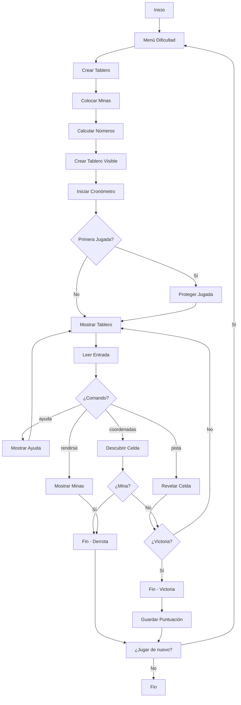

# 🎮 BuscaMinas - Juego en Consola

**Proyecto:** Juego de Buscaminas completo sin interfaz gráfica  
**Autores:** Pablo Calderón, Hugo, Miguel, Alejandro e Íñigo  
**Curso:** 2º ASIR  
**Lenguaje:** Python 3

---

## 📋 Información del Proyecto

| Campo | Valor |
|-------|-------|
| **Nombre** | BuscaMinas en Consola |
| **Fecha** | 2025-2026 |
| **Categoría** | Python |
| **Estado** | 🟢 Completado |
| **Tecnologías** | Python 3, JSON, Colores ANSI |
| **Líneas de Código** | ~670 líneas |
| **Funciones** | 29 funciones |

---

## 🎯 Descripción

Este proyecto es una implementación completa del clásico juego del BuscaMinas, totalmente funcional en consola, sin interfaz gráfica. El proyecto incluye **colores ANSI**, **sistema de puntuaciones** persistentes, **protección de primera jugada**, **cronómetro en tiempo real**, y **múltiples niveles de dificultad**.

!!! abstract "Resumen"
    Juego de lógica donde debes descubrir todas las celdas sin pisar las minas. Incluye 3 niveles de dificultad, sistema de récords, comandos especiales y visualización con colores.

---

## 🎯 Objetivos del Proyecto

- [x] Implementar lógica completa del juego BuscaMinas
- [x] Crear sistema de visualización con colores ANSI
- [x] Implementar 3 niveles de dificultad configurable
- [x] Añadir protección de primera jugada
- [x] Desarrollar sistema de puntuaciones persistentes
- [x] Implementar cronómetro y comandos especiales
- [x] Optimizar algoritmo de expansión (iterativo vs recursivo)
- [x] Validar entradas y gestionar errores

---

## ⚙️ Instalación y Configuración

### Requisitos Previos

```bash
# Python 3.6 o superior
python --version
# Python 3.12.0
```

### Instalación

=== "Windows"

    ```bash
    # Clonar o descargar el proyecto
    git clone https://github.com/Pabloceda/ProyectoPython.git

    # Nos colocamos en el directorio del proyecto 
    cd ProyectoPython
    
    # Ejecutar el juego
    python BuscaMinas.py
    ```

=== "Linux/Mac"

    ```bash
    # Clonar o descargar el proyecto
    git clone https://github.com/Pabloceda/ProyectoPython.git

    # Nos colocamos en el directorio del proyecto 
    cd ProyectoPython
    
    # Ejecutar el juego
    python3 BuscaMinas.py
    ```

### Archivos del Proyecto

```
ProyectoPython/
├── BuscaMinas.py                  # Código principal del juego
├── puntuaciones.json              # Mejores tiempos guardados
├── DocumentacionBuscaMinas.md     # Documentación técnica
└── PlanEstudioBuscaMinas.md       # Plan de estudio del código
```

!!! tip "Consejo"
    El archivo `puntuaciones.json` se crea automáticamente la primera vez que completas un nivel.

---

## 🚀 Uso

### Inicio del Juego

Al ejecutar el programa, aparece el menú de dificultad:

```
==============================================
       🎮 BUSCAMINAS - MENÚ PRINCIPAL
==============================================
Selecciona un nivel de dificultad:

1. 🟢 Fácil   (6x6, 5 minas)
2. 🟡 Medio   (8x8, 10 minas)
3. 🔴 Difícil (12x12, 20 minas)
```

### Durante el Juego

```python
# Ejemplo de tablero visible
     0  1  2  3  4  5
 0 | #  #  #  #  #  # |
 1 | #  1  0     0  # |
 2 | #  1  0     1  1 |
 3 | #  #  #  #  #  # |
```

### Comandos Disponibles

| Comando | Función |
|---------|---------|
| `fila columna` | Descubre celda (ej: `2 3`) |
| `ayuda` | Muestra todos los comandos |
| `pista` | Revela celda segura automáticamente |
| `rendirse` | Muestra todas las minas y termina |
| `salir` | Sale del juego |

---

## 📁 Estructura del Código

El código está organizado en **13 partes** principales:

### Parte 1: Configuración Global

```python linenums="1"
# Configuraciones de dificultad
CONFIGURACIONES = {
    '1': {'nombre': 'Fácil', 'filas': 6, 'columnas': 6, 'minas': 5},
    '2': {'nombre': 'Medio', 'filas': 8, 'columnas': 8, 'minas': 10},
    '3': {'nombre': 'Difícil', 'filas': 12, 'columnas': 12, 'minas': 20}
}

# Archivo para persistencia
ARCHIVO_PUNTUACIONES = 'puntuaciones.json'
```

### Parte 2: Sistema de Colores ANSI

```python linenums="1"
class Colores:
    """Clase con códigos de colores ANSI para la consola"""
    RESET = '\033[0m'
    BOLD = '\033[1m'
    ROJO = '\033[91m'
    VERDE = '\033[92m'
    AMARILLO = '\033[93m'
    AZUL = '\033[94m'
    MAGENTA = '\033[95m'
    CIAN = '\033[96m'
    # ...más colores

# Mapeo de números a colores
COLORES_NUMEROS = {
    '1': Colores.AZUL,
    '2': Colores.VERDE,
    '3': Colores.ROJO,
    # ...
}
```

!!! info "Sistema de Colores"
    Cada número tiene un color distintivo para facilitar la identificación de patrones en el juego.

### Parte 3: Crear Tablero

```python linenums="1"
def crear_tablero():
    """
    Crea un tablero vacío representado como lista de listas.
    Cada celda contiene 0 (sin mina) inicialmente.
    
    Returns:
        list: Tablero de juego (matriz de FILAS x COLUMNAS)
    """
    tablero = []
    for i in range(FILAS):
        fila = []
        for j in range(COLUMNAS):
            fila.append(0)  # 0 = sin mina
        tablero.append(fila)
    return tablero
```

**Explicación:**
- Crea una matriz dinámica basada en `FILAS` y `COLUMNAS`
- Inicializa todas las celdas en `0` (sin mina)
- Usa listas anidadas para representar la matriz 2D

### Parte 4: Colocar Minas

```python linenums="1" hl_lines="13-20"
def colocar_minas(tablero, num_minas):
    """
    Coloca minas aleatoriamente en el tablero.
    Una mina se representa con el valor -1.
    """
    minas_colocadas = 0
    
    while minas_colocadas < num_minas:
        # Genera posición aleatoria
        fila = random.randint(0, FILAS - 1)
        columna = random.randint(0, COLUMNAS - 1)
        
        # Solo coloca mina si la celda está vacía
        if tablero[fila][columna] != -1:
            tablero[fila][columna] = -1  # -1 = mina
            minas_colocadas += 1
```

**Lógica clave:**
- Usa `random.randint()` para posiciones aleatorias
- Verifica que no haya mina previa (`!= -1`)
- Continúa hasta colocar todas las minas

### Parte 5: Algoritmo de Descubrimiento (Iterativo)

```python linenums="211" hl_lines="18-28"
def descubrir_celda(tablero, tablero_visible, fila, columna):
    """
    Descubre celda usando algoritmo ITERATIVO con pila.
    Evita límites de recursión y mejora rendimiento.
    """
    # Validaciones iniciales
    if fila < 0 or fila >= FILAS or columna < 0 or columna >= COLUMNAS:
        return True
    
    if tablero_visible[fila][columna] != '#':
        return True
    
    if tablero[fila][columna] == -1:
        return False  # ¡Mina! Juego terminado
    
    # Algoritmo iterativo con pila
    pila = [(fila, columna)]
    
    while pila:
        f, c = pila.pop()
        
        # Validaciones
        if f < 0 or f >= FILAS or c < 0 or c >= COLUMNAS:
            continue
        if tablero_visible[f][c] != '#':
            continue
        
        valor = tablero[f][c]
        
        if valor == 0:
            tablero_visible[f][c] = ' '  # Celda vacía
            # Añade celdas adyacentes a la pila
            for i in range(-1, 2):
                for j in range(-1, 2):
                    if i != 0 or j != 0:
                        pila.append((f + i, c + j))
        else:
            tablero_visible[f][c] = str(valor)  # Muestra número
    
    return True
```

??? success "Ventaja del Algoritmo Iterativo"
    - ✅ No hay límite de profundidad de recursión
    - ✅ Mejor uso de memoria
    - ✅ Mismo resultado que versión recursiva
    - ✅ Funciona en tableros muy grandes

---

## ✨ Características Clave

### 1. Protección de Primera Jugada

```python linenums="1"
def proteger_primera_jugada(tablero, fila, columna):
    """
    Asegura que la primera jugada nunca sea una mina.
    Si hay mina, la mueve a otra posición.
    """
    if tablero[fila][columna] == -1:
        # Busca celda vacía para mover la mina
        for i in range(FILAS):
            for j in range(COLUMNAS):
                if tablero[i][j] != -1:
                    tablero[i][j] = -1  # Mueve mina aquí
                    tablero[fila][columna] = 0  # Celda segura
                    calcular_numeros(tablero)  # Recalcula
                    return
```

### 2. Sistema de Puntuaciones

```python linenums="1"
def guardar_puntuacion(dificultad, tiempo):
    """Guarda puntuación si es nuevo récord"""
    puntuaciones = cargar_puntuaciones()
    tiempo_redondeado = round(tiempo, 2)  # (1)!
    
    if dificultad not in puntuaciones or tiempo_redondeado < puntuaciones[dificultad]:
        puntuaciones[dificultad] = tiempo_redondeado
        
        # Guarda con UTF-8 para tildes
        with open(ARCHIVO_PUNTUACIONES, 'w', encoding='utf-8') as f:  # (2)!
            json.dump(puntuaciones, f, indent=4, ensure_ascii=False)
        
        return True  # Es récord
    return False
```

1.  Redondea a 2 decimales para legibilidad
2.  `ensure_ascii=False` permite mostrar "Fácil" en lugar de `F\\u00e1cil`

### 3. Cronómetro en Tiempo Real

```python linenums="1"
def jugar(filas, columnas, num_minas, nombre_dificultad):
    tiempo_inicio = time.time()  # Inicia cronómetro
    
    while juego_activo:
        # Calcula tiempo transcurrido
        tiempo_actual = time.time() - tiempo_inicio
        minutos = int(tiempo_actual // 60)
        segundos = int(tiempo_actual % 60)
        
        print(f"⏱️  Tiempo: {minutos:02d}:{segundos:02d}")
```

### 4. Sistema de Pistas

```python linenums="1"
def obtener_celda_segura(tablero, tablero_visible):
    """Encuentra celda segura aleatoria para pista"""
    celdas_seguras = []
    
    for i in range(FILAS):
        for j in range(COLUMNAS):
            if tablero_visible[i][j] == '#' and tablero[i][j] != -1:
                celdas_seguras.append((i, j))
    
    if celdas_seguras:
        return random.choice(celdas_seguras)
    return None
```

---

## 📊 Diagrama de Flujo del Juego



---

## 🎨 Sistema de Visualización

### Colores por Número

| Número | Color | Código ANSI | Significado |
|--------|-------|-------------|-------------|
| 1 | 🔵 Azul | `\033[94m` | Una mina adyacente |
| 2 | 🟢 Verde | `\033[92m` | Dos minas adyacentes |
| 3 | 🔴 Rojo | `\033[91m` | Tres minas adyacentes |
| 4 | 🟣 Magenta | `\033[95m` | Cuatro minas |
| 5 | 🟡 Amarillo | `\033[93m` | Cinco minas |
| 6 | 🔷 Cian | `\033[96m` | Seis minas |
| 7-8 | ⚪ Blanco/Gris | `\033[97m` | Siete u ocho minas |

### Ejemplo de Tablero Coloreado

```python linenums="1"
def mostrar_tablero(tablero_visible):
    """Muestra tablero con colores ANSI"""
    print("\n" + Colores.CIAN + "   ", end="")
    
    # Encabezado de columnas
    for col in range(COLUMNAS):
        print(f"{col:2d} ", end="")
    print(Colores.RESET)
    
    # Filas con contenido
    for fila in range(FILAS):
        print(f"{Colores.CIAN}{fila:2d} {Colores.RESET}|", end="")
        
        for col in range(COLUMNAS):
            celda = tablero_visible[fila][col]
            
            if celda == '#':
                print(f" {Colores.GRIS}#{Colores.RESET} ", end="")
            elif celda == '*':
                print(f" {Colores.BG_ROJO}*{Colores.RESET} ", end="")
            elif celda in COLORES_NUMEROS:
                color = COLORES_NUMEROS[celda]
                print(f" {color}{celda}{Colores.RESET} ", end="")
            else:
                print(f"   ", end="")
        
        print("|")
```

---

## 🐛 Problemas Resueltos

### Problema 1: Victoria No Detectada con Pistas

**Descripción:** Al usar comando `pista` para descubrir últimas celdas, el juego no detectaba victoria automáticamente.

**Causa:** No había verificación de victoria después de usar pista.

**Solución:**
```python linenums="1"
# Después de descubrir celda por pista
if verificar_victoria(tablero_visible):
    tiempo_final = time.time() - tiempo_inicio
    print("¡FELICIDADES!")
    # ... guardar puntuación
    juego_activo = False
    break
```

### Problema 2: Desalineación del Tablero

**Descripción:** En niveles Fácil y Medio, las columnas no alineaban con el encabezado.

**Causa:** Margen dinámico calculado incorrectamente para tableros pequeños.

**Solución:**
```python linenums="1"
# ANTES (margen dinámico - causaba desalineación)
print("\n" + Colores.CIAN + " " * (ancho_fila + 1), end="")

# DESPUÉS (margen fijo de 3 espacios)
print("\n" + Colores.CIAN + "   ", end="")
```

### Problema 3: Codificación UTF-8 en JSON

**Descripción:** Nombres con tilde aparecían como `F\\u00e1cil`.

**Solución:**
```python linenums="1"
with open(ARCHIVO_PUNTUACIONES, 'w', encoding='utf-8') as f:
    json.dump(puntuaciones, f, indent=4, ensure_ascii=False)
```

---

## 🧪 Testing

### Casos de Prueba

| Caso | Entrada | Resultado Esperado |
|------|---------|-------------------|
| Primera jugada mina | `0 0` (con mina) | Mina se mueve, celda segura |
| Celda vacía | `2 3` (valor 0) | Expande celdas vecinas |
| Victoria | Todas seguras | Mensaje victoria + guardar tiempo |
| Comando pista | `pista` | Revela celda segura |
| Comando ayuda | `ayuda` | Muestra comandos |

---

## 📚 Recursos y Referencias

### Documentación

- [Código fuente completo](file:///e:/ALBOR%20-%20ILERNA/2º%20CURSO/Python/ProyectoPython/BuscaMinas.py)
- [Documentación técnica original](file:///e:/ALBOR%20-%20ILERNA/2º%20CURSO/Python/ProyectoPython/DocumentacionBuscaMinas.md)

### Referencias Externas

- [Algoritmo BuscaMinas - Wikipedia](https://es.wikipedia.org/wiki/Buscaminas)
- [Colores ANSI en Python](https://stackoverflow.com/questions/287871)
- [JSON en Python](https://docs.python.org/3/library/json.html)

---

## 🔄 Próximas Mejoras

- [ ] Añadir sistema de banderas para marcar minas
- [ ] Implementar modo multijugador competitivo
- [ ] Crear interfaz gráfica con Pygame
- [ ] Añadir más niveles de dificultad personalizables
- [ ] Sistema de logros y estadísticas

---

## 📝 Notas Adicionales

!!! tip "Rendimiento"
    El algoritmo iterativo permite tableros de hasta 50x50 sin problemas de rendimiento.

!!! warning "Compatibilidad"
    Los colores ANSI funcionan en la mayoría de terminales modernas. En Windows, se requiere Windows 10+ o activar soporte ANSI.

---

## 👤 Autores

**Pablo Calderón, Hugo, Miguel, Alejandro e Íñigo**

- Curso: 2º ASIR
- Proyecto: Buscaminas en Consola
- Fecha: 2025-2026
- Última actualización: Enero 2026
