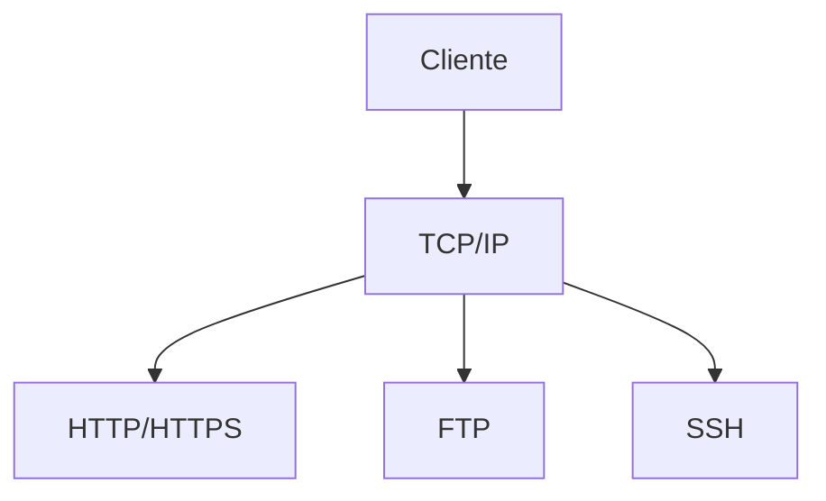

# 🌐 Proyectos de Redes

Configuración de redes, servidores y servicios de red e Internet.

---

## 🔧 Proyectos y Configuraciones

!!! tip "Servicios de Red"
    Aquí documentaré configuraciones de Apache, servidores DNS, DHCP y más.

### Temas

- Configuración de Apache
- Servicios DNS
- Servidores DHCP
- Configuración de routers
- VLANs y subredes

---

## 📡 Protocolos

