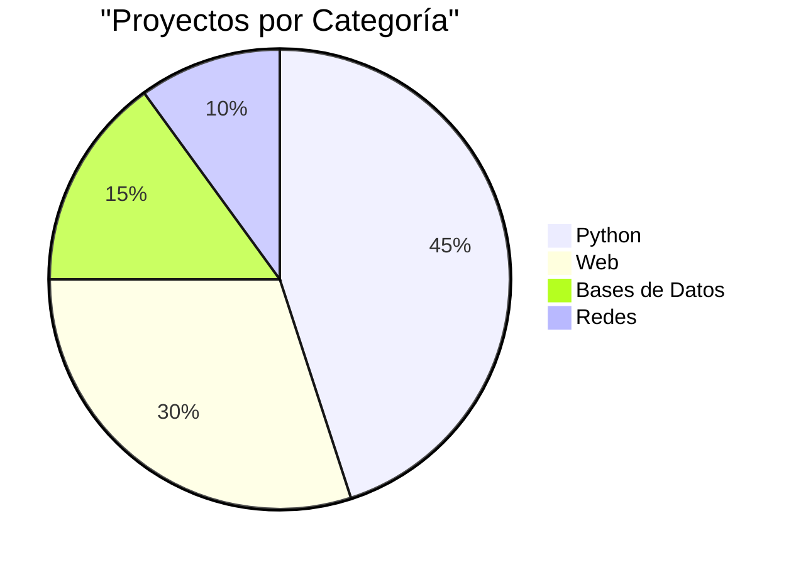

# 👋 Sobre Mí

¡Hola! Soy **Pablo Ceda**, estudiante de desarrollo de aplicaciones y apasionado por la programación.

---

## 🎓 Formación

📚 **Estudiante de Desarrollo de Aplicaciones**

- Segundo curso
- Especialización en desarrollo web y aplicaciones
- Instituto ILERNA

---

## 💻 Tecnologías

### Lenguajes de Programación

=== "Python"
    Mi lenguaje principal. Lo uso para:
    
    - Desarrollo de juegos
    - Scripts y automatización
    - Proyectos académicos

=== "Web"
    Stack de desarrollo web:
    
    - **Frontend:** HTML5, CSS3, JavaScript
    - **Backend:** PHP
    - **Bases de Datos:** MySQL, SQLite

=== "Otros"
    Otras tecnologías:
    
    - Git & GitHub
    - MkDocs
    - Configuración de servidores

### Nivel de Competencia

| Tecnología | Nivel | Experiencia |
|-----------|-------|-------------|
| Python | ⭐⭐⭐⭐ | 2 años |
| HTML/CSS | ⭐⭐⭐⭐ | 2 años |
| JavaScript | ⭐⭐⭐ | 1 año |
| PHP | ⭐⭐⭐ | 1 año |
| SQL | ⭐⭐⭐ | 1 año |

---

## 🎯 Intereses

!!! note "Áreas de Interés"
    - 🎮 Desarrollo de videojuegos
    - 🌐 Desarrollo web full-stack
    - 🔒 Seguridad informática
    - 🤖 Automatización con Python

---

## 📊 Estadísticas

---

## 🌟 Proyectos Destacados

### 🥇 BuscaMinas

Juego completo con múltiples niveles, sistema de puntuaciones y colores.

[Ver proyecto →](python/buscaminas.md){ .md-button }

---

## 📫 Contacto

!!! tip "¿Quieres contactarme?"
    - :fontawesome-brands-github: [GitHub: @pabloceda](https://github.com/pabloceda)
    - :fontawesome-solid-envelope: Email: (tu email si quieres)

---

## 🎓 Objetivos 2026

- [x] Aprender Material for MkDocs
- [ ] Completar proyectos de redes
- [ ] Desarrollar aplicación web completa
- [ ] Contribuir a proyecto open source

---

!!! quote "Filosofía"
    *"La mejor manera de aprender es documentando lo que haces."*

---

    
✨ Gracias por visitar mi documentación ✨

