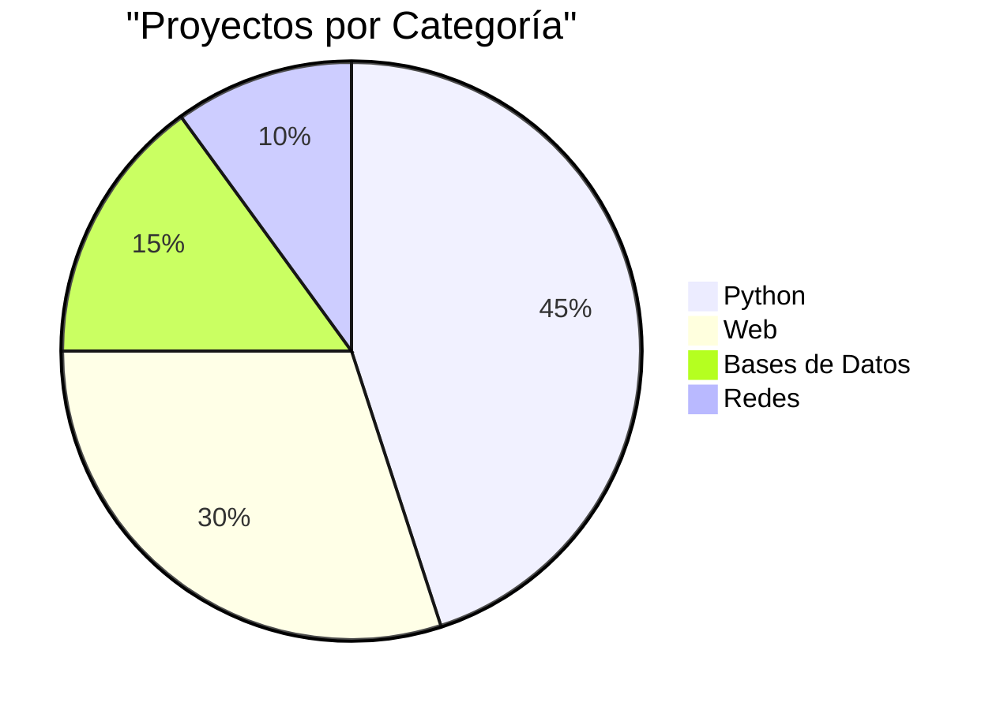

# 👋 Sobre Mí

¡Hola! Soy **Pablo**, estudiante de Administración de Sistemas Informáticos en Red. Aquí encontrarás toda la documentación de mis proyectos.

---

## 🎓 Formación

📚 **Estudiante de Administración de Sistemas Informáticos en Red**

- Segundo curso

---

## 💻 Tecnologías

### Lenguajes de Programación

=== "Python"
    Mi lenguaje principal. Lo uso para:
    
    - Desarrollo de juegos
    - Scripts y automatización
    - Proyectos académicos

=== "Web"
    Stack de desarrollo web:
    
    - **Frontend:** HTML5, CSS3, JavaScript
    - **Backend:** PHP
    - **Bases de Datos:** MySQL, SQLite

=== "Otros"
    Otras tecnologías:
    
    - Git & GitHub
    - MkDocs
    - Configuración de servidores

### Nivel de Competencia

| Tecnología | Nivel | Experiencia |
|-----------|-------|-------------|
| Python | ⭐⭐⭐⭐ | 2 años |
| HTML/CSS | ⭐⭐⭐⭐ | 2 años |
| JavaScript | ⭐⭐⭐ | 1 año |
| PHP | ⭐⭐⭐ | 1 año |
| SQL | ⭐⭐⭐ | 1 año |

---

## 🎯 Intereses

!!! note "Áreas de Especialización ASIR"
    - 🖥️ **Administración de Sistemas:** Gestión de servidores Linux/Windows
    - 🌐 **Redes:** Configuración y optimización de infraestructuras
    - 🔒 **Seguridad:** Hardening, firewalls y protección de sistemas
    - 🐳 **Contenedores:** Docker y orquestación con Kubernetes
    - ☁️ **Cloud Computing:** Infraestructura como código
    - 🤖 **Automatización:** Scripts y herramientas de DevOps

---

## 🛠️ Infraestructura y Herramientas

### Sistemas y Servidores

=== "Linux"
    - Ubuntu Server
    - Configuración de servicios (Apache, DNS, DHCP)
    - Gestión de usuarios y permisos
    - Shell scripting

=== "Redes"
    - Configuración de routers y switches
    - VLANs y subnetting
    - Protocolos TCP/IP
    - Servicios de red (DNS, DHCP, FTP)

=== "Seguridad"
    - Firewalls y políticas de seguridad
    - SSL/TLS y certificados
    - Backup y recuperación
    - Alta disponibilidad

---

## 📊 Estadísticas

---

## 🌟 Proyectos Destacados

### 🥇 BuscaMinas

Juego completo con múltiples niveles, sistema de puntuaciones y colores.

[Ver proyecto →](python/buscaminas.md){ .md-button }

---

## 📫 Contacto

!!! tip "¿Quieres contactarme?"
    - :fontawesome-brands-github: [GitHub: @pabloceda](https://github.com/pabloceda)
    - :fontawesome-solid-envelope: Email: (tu email si quieres)

---

## � Objetivos 2026

### 📚 Certificaciones Profesionales

- [ ] **🔒 CompTIA Security+** - Fundamentos de ciberseguridad
- [ ] **🔐 CompTIA CySA+** - Analista de ciberseguridad
- [ ] **🌐 Cisco CCNA** - Certificación de redes Cisco
- [ ] **☁️ AWS Cloud Practitioner** - Fundamentos de cloud

### 🛠️ Tecnologías a Dominar

- [x] Aprender Material for MkDocs
- [ ] **🐳 Docker** - Contenedores y deployment
- [ ] **☸️ Kubernetes** - Orquestación de contenedores
- [ ] **🔧 Ansible** - Automatización de configuraciones
- [ ] **📊 Prometheus + Grafana** - Monitorización
- [ ] Desarrollar infraestructura completa de alta disponibilidad
- [ ] Contribuir a proyecto open source de DevOps

---

!!! quote "Filosofía"
    *"Un buen administrador de sistemas documenta todo lo que hace."*

---

    
✨ Gracias por visitar mi documentación ✨

