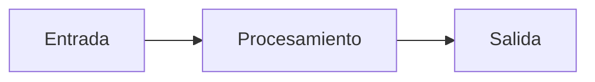

# 📄 Plantilla de Proyecto

Esta es una plantilla estándar para documentar nuevos proyectos. Copia este archivo y personalízalo.

---

## 📋 Información del Proyecto

| Campo | Valor |
|-------|-------|
| **Nombre** | Nombre del Proyecto |
| **Fecha** | DD/MM/YYYY |
| **Categoría** | Python / Web / BD / Redes / Seguridad |
| **Estado** | 🟢 Completado / 🟡 En progreso / 🔴 Pausado |
| **Tecnologías** | Lista de tecnologías usadas |

---

## 🎯 Descripción

Breve descripción del proyecto (2-3 párrafos).

!!! abstract "Resumen"
    Resumen ejecutivo de 1-2 líneas del proyecto.

---

## 🎯 Objetivos

- [ ] Objetivo 1
- [ ] Objetivo 2
- [ ] Objetivo 3

---

## ⚙️ Instalación y Configuración

### Requisitos Previos

```bash
# Listar requisitos
python --version
pip --version
```

### Instalación

=== "Windows"

    ```bash
    # Comandos para Windows
    python -m venv venv
    venv\Scripts\activate
    pip install -r requirements.txt
    ```

=== "Linux/Mac"

    ```bash
    # Comandos para Linux/Mac
    python3 -m venv venv
    source venv/bin/activate
    pip install -r requirements.txt
    ```

### Configuración

1. Paso 1
2. Paso 2
3. Paso 3

---

## 🚀 Uso

### Ejemplo Básico

```python
# Código de ejemplo
def main():
    print("Hola Mundo")

if __name__ == "__main__":
    main()
```

### Casos de Uso

!!! example "Caso de Uso 1"
    Descripción y ejemplo del primer caso de uso.

!!! example "Caso de Uso 2"
    Descripción y ejemplo del segundo caso de uso.

---

## 📁 Estructura del Proyecto

```
proyecto/
├── src/
│   ├── main.py
│   └── utils.py
├── tests/
│   └── test_main.py
├── docs/
│   └── README.md
├── requirements.txt
└── .gitignore
```

---

## ✨ Características Clave

### Característica 1

Descripción detallada de la característica 1.

```python
# Código de ejemplo
codigo_ejemplo = "aquí"
```

### Característica 2

Descripción de la característica 2 con diagrama:



---

## 📸 Capturas de Pantalla / Ejemplos

!!! success "Resultado Esperado"
    ```
    Salida del programa o capturas de pantalla
    ```

---

## 🐛 Problemas Resueltos

### Problema 1

**Descripción:** Qué problema había

**Solución:** Cómo se resolvió

```python
# Código de la solución
solucion = "código aquí"
```

### Problema 2

**Descripción:** Otro problema encontrado

**Solución:** Su resolución

---

## 🧪 Testing

### Tests Unitarios

```python
def test_ejemplo():
    assert funcion() == resultado_esperado
```

### Cobertura

| Módulo | Cobertura |
|--------|-----------|
| main.py | 95% |
| utils.py | 88% |

---

## 📚 Recursos y Referencias

### Documentación

- [Enlace a documentación oficial](https://ejemplo.com)
- [Tutorial relevante](https://ejemplo.com)

### Artículos y Tutoriales

- Artículo 1
- Artículo 2

---

## 🔄 Próximas Mejoras

- [ ] Mejora 1
- [ ] Mejora 2
- [ ] Mejora 3

---

## 📝 Notas Adicionales

!!! tip "Consejo"
    Algún consejo importante sobre el proyecto.

!!! warning "Atención"
    Alguna advertencia o consideración especial.

---

## 👤 Autor

**Pablo Ceda**

- GitHub: [@pabloceda](https://github.com/pabloceda)
- Fecha de creación: DD/MM/YYYY
- Última actualización: DD/MM/YYYY
